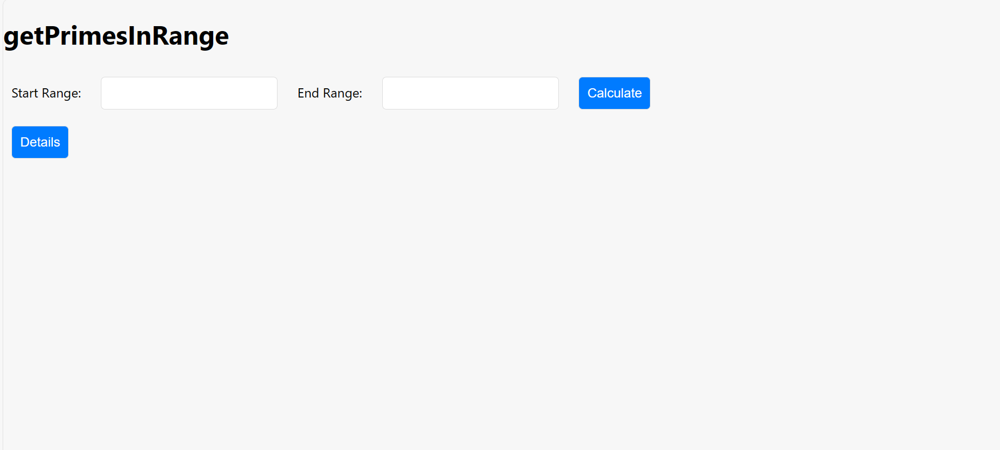
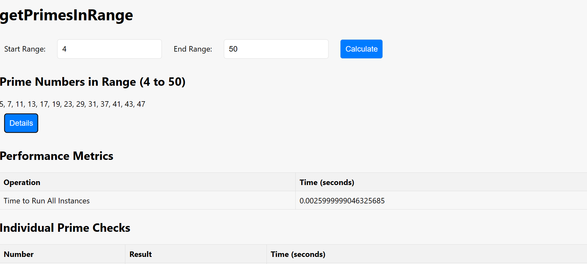
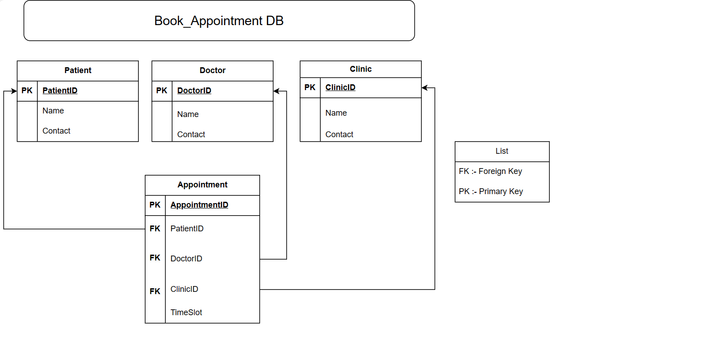

# Kennect-assignment

# Get Prime Numbers with Database Design HLD & LLD

## Live Demo

[https://kennect-assignment-8rgtxa0fv-akshays-projects-07fa9954.vercel.app/](https://kennect-assignment-8rgtxa0fv-akshays-projects-07fa9954.vercel.app/)

## Github Link :- 

[https://github.com/helloakshay27/Kennect-assignment/](https://github.com/helloakshay27/Kennect-assignment/)

## :fire: Technologies and Libraries

:point_right: Html  
:point_right: CSS  
:point_right: Javascript  
:point_right: SQL  
:point_right: draw.io  

## Screenshot

<<<<<<< HEAD
## Get-Prime-Numbers

## Database-Design-HLD-&-LLD
=======
#1Get-Prime-Numbers

#2Database-Design-HLD-&-LLD
=======
https://kennect-assignment-8rgtxa0fv-akshays-projects-07fa9954.vercel.app/
>>>>>>> dcbc82095193d63cb74db30903bcb8aa138a2fe4
>>>>>>> 2925336cd5222a4ae0d937fffcf8d72aefc01b7a
